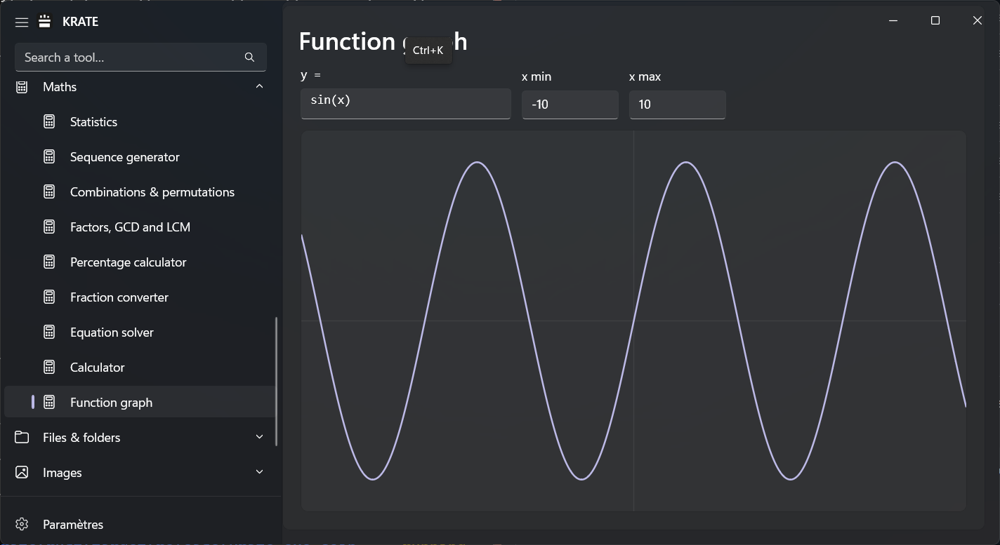
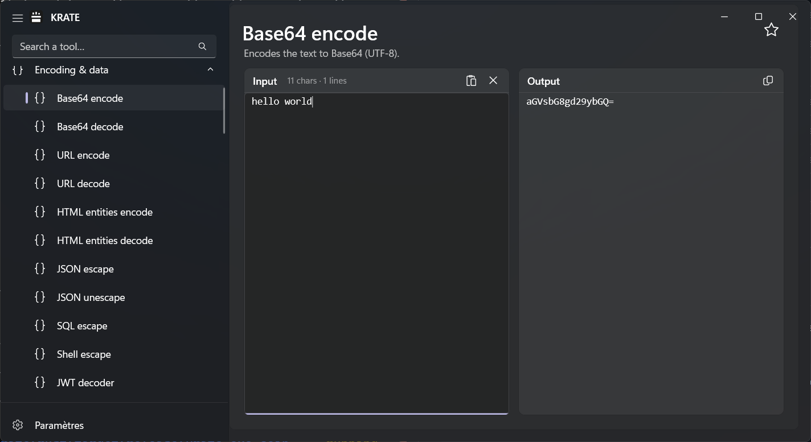
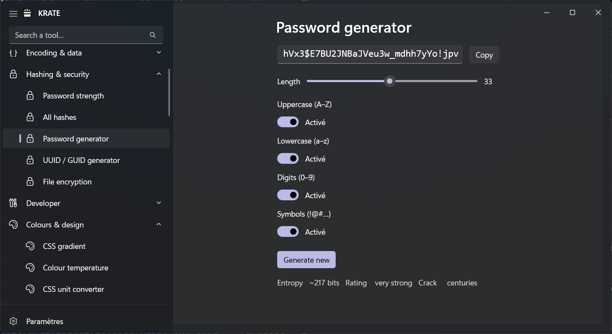
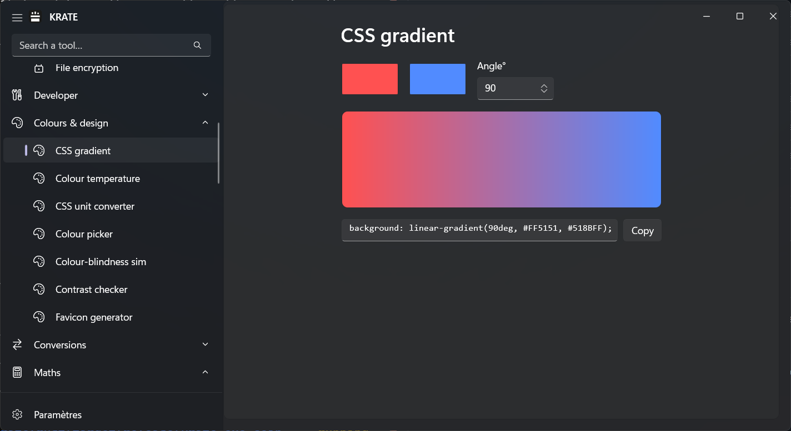
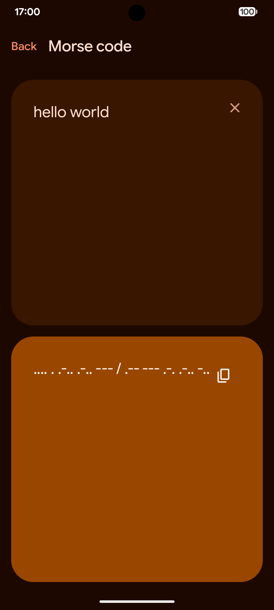
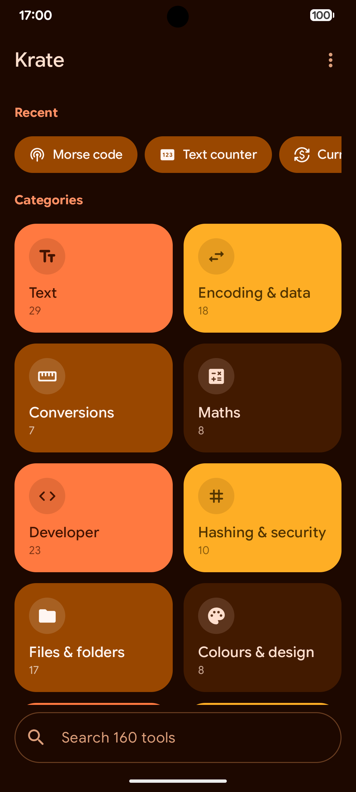
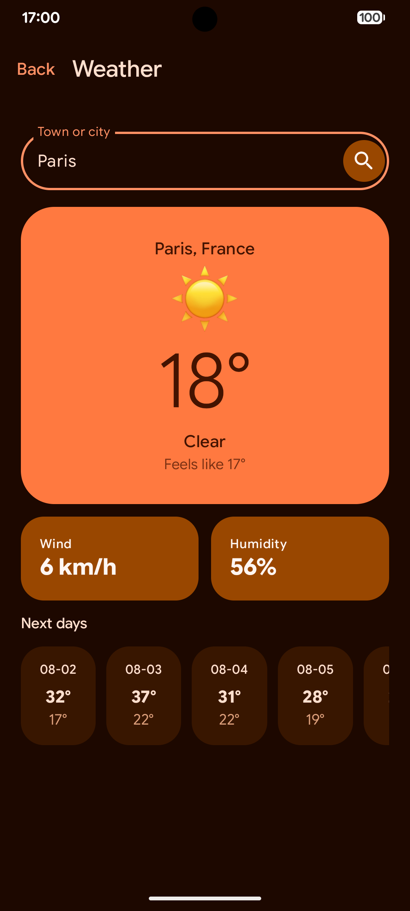

<div align="center">
  
  <h1>Krate Toolkit</h1>
  <p><strong>A beautiful, fast, offline utility toolbox for Windows, Android, and your Terminal.</strong></p>
</div>

---

Krate is a multi-platform collection of everyday developer tools, calculators, and converters packed into a single, offline application. It is designed to be instantly accessible whether you are at your desk, on the go, or deep in a terminal session.

<div align="center">
  <h3>Windows Desktop</h3>
  
</div>

## ✨ Features

- **Multi-Platform:** Native Windows App (WinUI 3), Native Android App (Kotlin), and a UNIX-style CLI.
- **100% Offline:** Everything happens locally on your device. Zero telemetry, zero cloud processing.
- **Lightning Fast:** Powered by a shared Rust Core library for instant startup and execution.
- **Beautiful UI:** Uses Windows 11 Fluent Design and Android Material You for a premium feel.

## 📸 Screenshots

### Windows Experience
<p align="center">
  
  
  
</p>

### Android Experience
<p align="center">
  
  
  
  
</p>

## 🚀 Download & Install

You can download the latest official versions from the **[GitHub Releases Page](../../releases)**.

- **Windows:** Download and run `Krate-Windows-Setup.exe`.
- **Android:** Download and install `Krate-Android-arm64.apk`.
- **Command Line:** Download `krate-cli.exe` and add it to your system PATH.

## 💻 CLI Usage

Krate provides a fast command-line interface that behaves exactly like standard UNIX tools:

```bash
# Get help for any tool
krate md5 --help

# Run tools directly
krate coin
krate dice

# Pipe data directly into Krate
echo "Hello World" | krate md5
```

## ❤️ Support & Links

If Krate makes your daily workflow easier, consider supporting the development!

- **GitHub:** [londheymanounou](https://github.com/londheymanounou)
- **Ko-fi:** [Support me on Ko-fi](https://ko-fi.com/londhey)

---
*Built with Rust, C# (WinUI 3), and Kotlin.*
